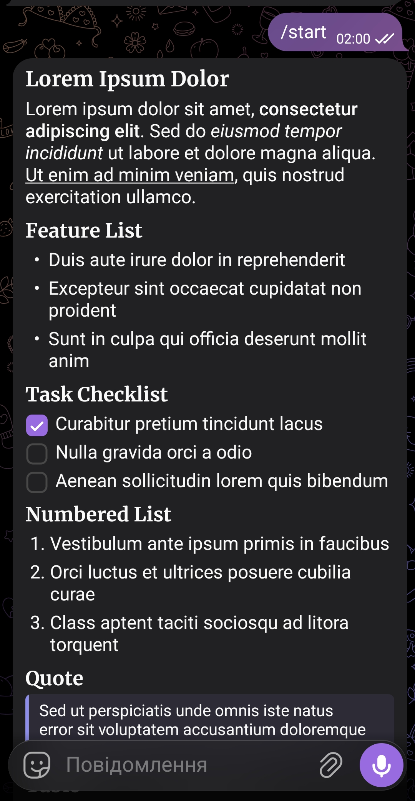

# aiogram Rich Messages Example

A minimal [aiogram](https://github.com/aiogram/aiogram) bot demonstrating **Telegram Bot API 10.1 Rich Messages** — structured HTML formatting for headings, lists, checkboxes, tables, slideshows, collages, and more.



## Setup

1. Clone the repository and install dependencies:

   ```bash
   git clone https://github.com/justoperator/rich-text-example-tg.git
   cd your-repo
   pip install -r requirements.txt
   ```

2. Create a `.env` file in the project root:

   ```
   BOT_TOKEN=your_bot_token_here
   ```

3. Run the bot:

   ```bash
   python main.py
   ```

4. Send `/start` to your bot in Telegram.

## Requirements

```
aiogram>=3.29.0
python-dotenv
```

## Supported HTML tags

Rich messages are sent via `InputRichMessage(html=...)`. Below is a reference of the tags used in this example, plus other commonly used ones.

### Text formatting

| Tag | Description |
|---|---|
| `<b>`, `<strong>` | Bold text |
| `<i>`, `<em>` | Italic text |
| `<u>`, `<ins>` | Underlined text |
| `<s>`, `<strike>`, `<del>` | Strikethrough text |
| `<code>` | Inline monospace code |
| `<mark>` | Highlighted text |
| `<sub>` | Subscript |
| `<sup>` | Superscript |
| `<tg-spoiler>` | Spoiler-hidden text |

### Links and mentions

| Tag | Description |
|---|---|
| `<a href="https://...">` | URL link |
| `<a href="mailto:...">` | Email link |
| `<a href="tel:...">` | Phone number link |
| `<a href="tg://user?id=...">` | Inline mention of a user |
| `<a name="anchor-name"></a>` | In-document anchor definition |
| `<a href="#anchor-name">` | Link to an anchor |

### Blocks

| Tag | Description |
|---|---|
| `<h1>`–`<h6>` | Section headings |
| `<p>` | Paragraph |
| `<pre>` | Preformatted block |
| `<pre><code class="language-python">...</code></pre>` | Code block with syntax language |
| `<footer>` | Footer text |
| `<hr/>` | Divider |
| `<blockquote>...<cite>Author</cite></blockquote>` | Block quotation with optional credit |
| `<aside>...<cite>Author</cite></aside>` | Pull quotation |
| `<details>` / `<details open>` | Collapsible block, requires `<summary>` |

### Lists

| Tag | Description |
|---|---|
| `<ul><li>...</li></ul>` | Unordered list |
| `<ol><li>...</li></ol>` | Ordered list (supports `start`, `type`, `reversed` attributes) |
| `<li><input type="checkbox"/></li>` | Checklist item |
| `<li><input type="checkbox" checked/></li>` | Checked checklist item |

### Tables

| Tag | Description |
|---|---|
| `<table bordered striped>` | Table with borders and striped rows |
| `<caption>` | Table caption |
| `<tr>` | Table row |
| `<th>` | Header cell |
| `<td colspan="2" rowspan="2" align="left" valign="top">` | Data cell with span and alignment |

### Media

| Tag | Description |
|---|---|
| `` | Photo block |
| `<video src="https://...">` | Video block (or animation for `.gif`) |
| `<audio src="https://...mp3">` | Audio block |
| `<audio src="https://...ogg">` | Voice note block |
| `<figure><figcaption>Caption<cite>Credit</cite></figcaption></figure>` | Media with caption and credit |
| `<tg-slideshow>...</tg-slideshow>` | Slideshow of `` items |
| `<tg-collage>...</tg-collage>` | Collage of `` items |
| `<tg-map lat="..." long="..." zoom="..."/>` | Embedded map (zoom range 13–20) |

### Other

| Tag | Description |
|---|---|
| `<tg-emoji emoji-id="...">fallback</tg-emoji>` | Custom emoji |
| `<tg-time unix="..." format="...">text</tg-time>` | Formatted date/time |
| `<tg-math>LaTeX</tg-math>` | Inline math expression |
| `<tg-math-block>LaTeX</tg-math-block>` | Block math expression |
| `<tg-reference name="...">...</tg-reference>` | Footnote reference definition |

## Notes

- Media blocks (``, `<video>`, `<audio>`, `<tg-slideshow>`, `<tg-collage>`, `<tg-map>`) must appear as standalone blocks, not nested inline inside a paragraph.
- Media URLs must use `http` or `https`.
- Maximum limits: 32,768 UTF-8 characters, 500 blocks, 16 nesting levels, 50 media attachments, 20 table columns.
